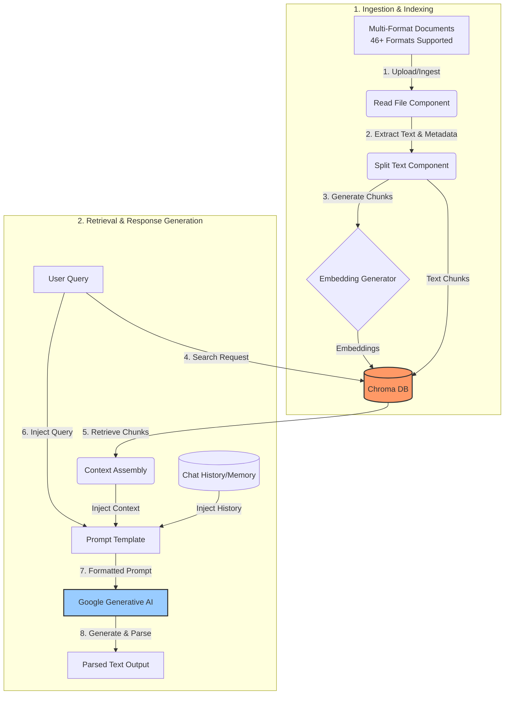
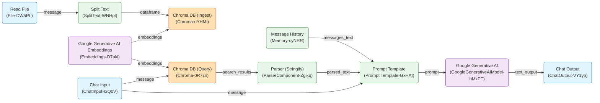

# Adaptive Multi-Format RAG System with Langflow & Chroma DB

An enterprise-ready, low-code Retrieval-Augmented Generation (RAG) platform designed to ingest, chunk, and index **46 different file formats** (including documents, data sheets, presentations, source code, images, markup, and archives) into a local vector database, enabling context-aware conversational interactions with conversational memory.

This repository contains a complete, production-ready RAG pipeline exported from [Langflow](https://www.langflow.org/). The system uses **Google Generative AI (Gemini 2.5 Flash)** for reasoning, **Chroma DB** as a local vector store, and conversational memory to maintain multi-turn chat history.

---

## 📂 Supported Document Formats (44 Formats)

The ingestion engine is pre-configured to process a diverse range of 44 standard and development file types. They are categorized below:

| Category                           | Extensions                                                                                                                              |
| :--------------------------------- | :-------------------------------------------------------------------------------------------------------------------------------------- |
| **Documents & Layouts**      | `pdf`, `docx`, `docm`, `dotx`, `dotm`, `xlsx`, `xls`, `pptx`, `pptm`, `ppsx`, `ppsm`, `potx`, `potm`, `txt` |
| **Web & Structured Data**    | `html`, `htm`, `xhtml`, `xml`, `json`, `csv`, `yaml`, `yml`                                                             |
| **Markup & Documentation**   | `md`, `mdx`, `adoc`, `asc`, `asciidoc`                                                                                        |
| **Developer Code Files**     | `py`, `js`, `ts`, `tsx`, `sh`, `sql`                                                                                        |
| **Images (OCR & Ingestion)** | `png`, `jpg`, `jpeg`, `webp`, `bmp`, `tiff`                                                                                 |
| **Compressed & Archives**    | `zip`, `tar`, `tgz`, `gz`, `bz2`                                                                                              |

---

## 🏗️ Architecture Overview

The system operates in two core pipelines: **Ingestion & Indexing** (offline/setup phase) and **Retrieval & Response Generation** (online/runtime phase).

### 1. High-Level Data Flow (As per `architecture.png` + Multi-Format Ingestion)



### Step-by-Step Execution Lifecycle

1. **Input Documents:** The user uploads any supported document (PDF, Word, Excel, Markdown, CSV, Python script, or ZIP archive).
2. **Load & Chunk:** The system parses the document contents, extracts text and structural metadata, and splits the stream into manageable, overlapping paragraphs (chunks) to retain local context.
3. **Generate & Save Embeddings:** The text chunks are vectorized using **Google Gemini Embeddings** (or OpenAI) and written to the persistent local **Chroma DB** instance.
4. **Similarity Search:** When a user queries the system, the query is vector-searched against Chroma DB to find the most semantically relevant text chunks.
5. **Context Assembly:** Chroma DB returns the matching passages (`CONTEXT`) to build the prompt.
6. **Prompt Assembly:** The system dynamically merges the original user question (`QUERY`), the retrieved `CONTEXT`, and the `CONVERSATIONAL HISTORY` into a unified prompt.
7. **LLM Inference:** The compiled prompt is sent to the LLM (Google Gemini / OpenAI) for reasoning.
8. **Parse & Render Output:** The model's response is formatted, parsed, and streamed back to the chat interface.

---

## 🧩 Langflow Component Pipeline

The exported flow file `flow.json` constructs the following visual execution graph in Langflow:



---

## ⚙️ Component Details & Parameters

Below are the configurations defined inside `flow.json` for the principal nodes:

| Component Name                            | Type             | Key Configuration Parameters                                                                      | Description                                                                                           |
| :---------------------------------------- | :--------------- | :------------------------------------------------------------------------------------------------ | :---------------------------------------------------------------------------------------------------- |
| **Read File**                       | File Ingest      | `ocr_engine: 'easyocr'`, `use_multithreading: True`, `ignore_unsupported_extensions: True`  | Reads local files, converting text or OCR scanned text into standard messages.                        |
| **Split Text**                      | Text Processing  | `chunk_size: 1000`, `chunk_overlap: 200`, `separator: '\n'`                                 | Splits text messages into chunk dataframes to fit the context windows and improve search granularity. |
| **Google Generative AI Embeddings** | Embedding Model  | `model_name: 'gemini-embedding-001'`, `api_key: '${GEMINI_API_KEY}'`                          | Computes semantic vector representations of text segments.                                            |
| **Chroma DB**                       | Vector Store     | `collection_name: 'pdf-ragg'`, `persist_directory: 'chroma_dbb'`, `number_of_results: 10`   | Handles storage of document vectors and queries similarities.                                         |
| **Message History**                 | Chat Memory      | `n_messages: 100`, `order: 'Ascending'`, `template: '{sender_name}: {text}'`                | Retains conversational context across multiple turns of user chats.                                   |
| **Prompt Template**                 | Prompt Engineer  | Customizable multi-scenario prompt with `{context}`, `{history}`, `{question}` placeholders | Implements system directives prioritizing Contextual RAG or Conversational Chat depending on intent.  |
| **Google Generative AI**            | Language Model   | `model_name: 'gemini-2.5-flash'`, `temperature: 0.1`, `api_key: '${GEMINI_API_KEY}'`        | Reasoning engine that generates detailed answers based only on context.                               |
| **Parser**                          | Custom Component | `mode: 'Stringify'`, `pattern: 'Text: {text}'`                                                | Compiles raw list structures/DataFrames returned by Chroma DB into a clean context string.            |

---

## 🔒 Security Best Practices: Decoupling Secrets

To prevent exposing sensitive API credentials (such as Google Gemini/OpenAI API keys) on public version control platforms like GitHub:

1. **Placeholder Injection:** The API key parameters in `flow.json` are bound to environment variables via the `${GEMINI_API_KEY}` syntax.
2. **Environment File:** Local configurations are stored in a `.env` file, which is excluded from git commits.
3. **Gitignore:** A `.gitignore` file has been added to automatically prevent pushing database sqlite files, logs, python environments, or the local `.env` file.

---

## 🚀 Getting Started & Setup

### Prerequisites

- Python 3.10 or later installed on your system.
- A Google Gemini API key (or OpenAI API Key).

### 1. Clone the Project & Set Up Environment

```bash
# Navigate to the workspace
cd d:/pdf-rag

# Create and activate virtual environment (Windows)
python -m venv .venv
.venv\Scripts\activate

# Install dependencies
pip install langflow
```

### 2. Configure Credentials

1. Copy the `.env.example` file to create your own local `.env`:
   ```bash
   copy .env.example .env
   ```
2. Open `.env` and fill in your Gemini API key:
   ```env
   GEMINI_API_KEY=AIzaSyYourGeminiApiKeyHere...
   ```

### 3. Load & Run Langflow

1. Start the Langflow dashboard locally:
   ```bash
   langflow run
   ```
2. Open your browser and navigate to `http://127.0.0.1:7860`.
3. Select **New Project** -> **Upload Flow** and import the sanitized `flow.json` file in this directory.
4. Your API keys will load automatically from your environment variables (`.env`).
5. Open the **Playground** chat tab to start chatting with your uploaded files!

---

## 📤 Pushing to GitHub (Safe Guide)

Since this project has been sanitized, you can push it to GitHub without worrying about leaks. Follow these exact steps:

1. **Initialize Git Repository:**

   ```bash
   git init
   ```
2. **Add Files & Verify Ignored Files:**
   The `.gitignore` will keep database folders (`chroma_dbb/`) and your credentials (`.env`) safe. Verify this by checking the staging status:

   ```bash
   git status
   ```
   *(Ensure `.env`, `.venv`, and `chroma` folder paths are **not** listed under files to be committed.)*
3. **Commit the Project Files:**

   ```bash
   git add .
   git commit -m "feat: init multi-format RAG pipeline with Langflow and Gemini"
   ```
4. **Create a Repository on GitHub:**

   - Go to your GitHub dashboard and create a new repository (e.g. `multi-format-rag`).
   - Keep it Public or Private as you prefer.
   - Do **not** initialize it with a README, `.gitignore`, or License (as you have them already).
5. **Push Code to GitHub:**

   ```bash
   # Add your GitHub repository URL as remote origin
   git remote add origin https://github.com/YOUR_USERNAME/multi-format-rag.git

   # Set branch name to main and push
   git branch -M main
   git push -u origin main
   ```
